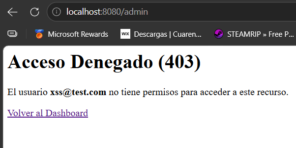
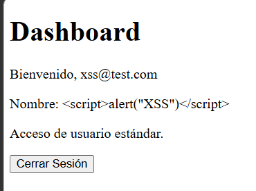
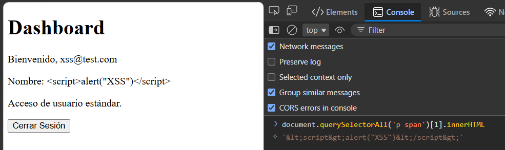
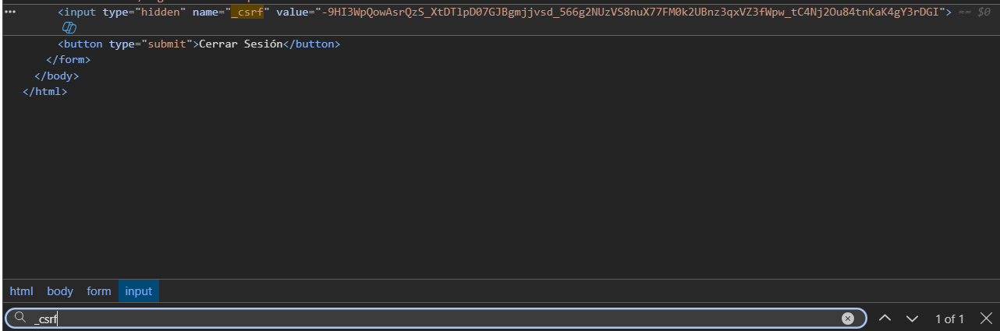
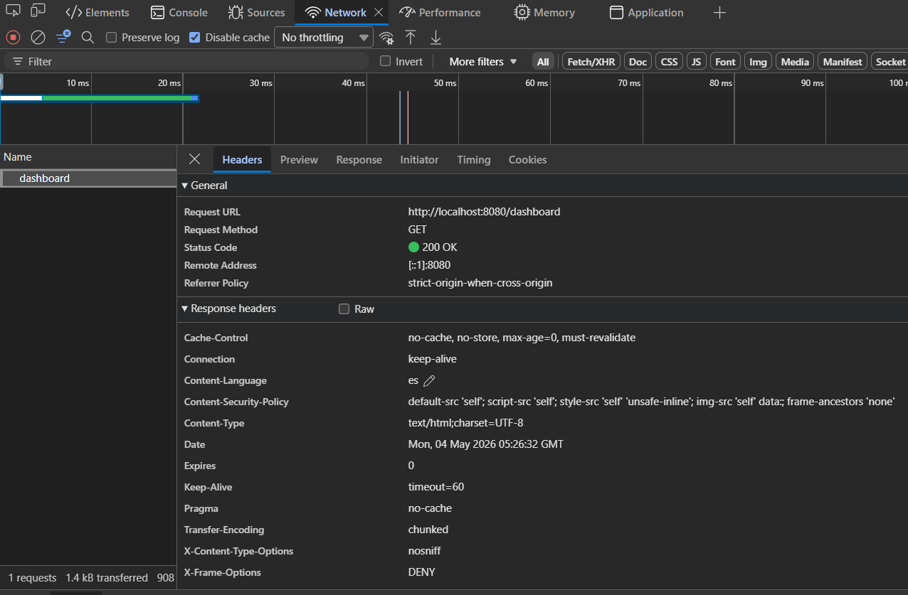
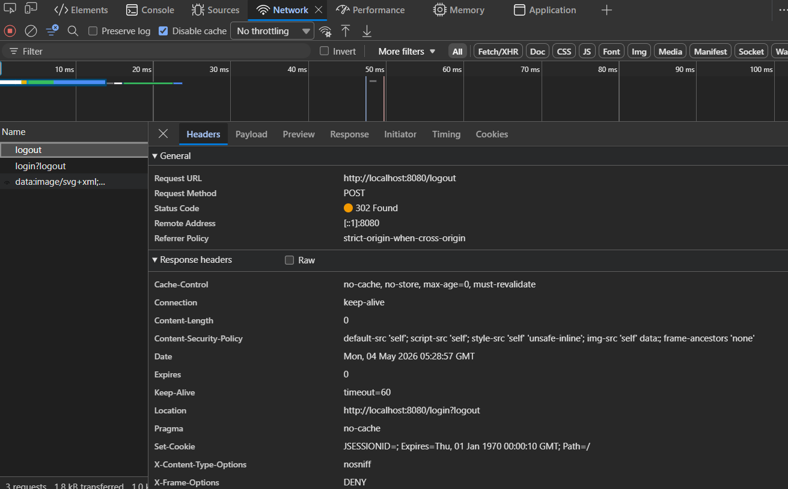

# moreno-post2-u9: Seguridad en Aplicaciones Web

Extensión del Post-Contenido 1. Implementación y verificación de protecciones
de seguridad en una aplicación Spring Boot con Spring Security.

## Tecnologías utilizadas

- Java 26
- Spring Boot 4.0.5
- Spring Security 7.0.4
- Thymeleaf 3.1.3
- MySQL 8.0
- Hibernate 7.2.7

## Cómo ejecutar el proyecto

1. Clona el repositorio
2. Crea la base de datos en MySQL:
```sql
   CREATE DATABASE estudiantes_db;
```
3. Configura tus credenciales en `src/main/resources/application.properties`
4. Ejecuta la aplicación desde IntelliJ IDEA o con:
```bash
   mvn spring-boot:run
```
5. Abre `http://localhost:8080/login` en el navegador

---

## Prueba 1: Autorización con @PreAuthorize

### ¿Qué se implementó?
Se agregaron anotaciones `@PreAuthorize` en `UsuarioService` con distintas
expresiones SpEL:

- `hasRole('ADMIN')` — solo ADMIN puede listar todos los usuarios
- `hasRole('ADMIN') or #email == authentication.name` — ADMIN o el propio
  usuario puede ver su perfil
- `hasAnyRole('ADMIN', 'USER')` — cualquier usuario autenticado puede buscar
  por ID
- `#usuario.email == authentication.name or hasRole('ADMIN')` — solo el
  propio usuario o ADMIN puede actualizar su nombre
- `hasRole('ADMIN')` — solo ADMIN puede cambiar roles

### ¿Qué ocurrió?
Al iniciar sesión con un usuario de rol USER e intentar acceder a
`/admin`, Spring Security lanzó `AccessDeniedException` y mostró
la página de error 403 personalizada con el nombre del usuario autenticado.
---

## Prueba 2: Mitigación de XSS con Thymeleaf

### ¿Qué se hizo?
Se registró un usuario con el siguiente nombre como payload XSS:
<script>alert("XSS")</script>

En el dashboard, el nombre se muestra usando `th:text`:

```html
<span th:text="${usuario.nombre}"></span>
```

### ¿Qué ocurrió?
Thymeleaf escapó automáticamente el contenido, mostrando el texto literal
en pantalla sin ejecutar el script. El navegador nunca interpretó el
contenido como código JavaScript.

### ¿Por qué funciona?
Thymeleaf convierte los caracteres peligrosos:

| Caracter original | Lo que guarda en el HTML |
|---|---|
| `<` | `&lt;` |
| `>` | `&gt;` |
| `"` | `&quot;` |
---

## Prueba 3: Cabecera Content-Security-Policy

### ¿Qué se configuró?
Se agregó una política CSP en `SecurityConfig` que indica al navegador
qué fuentes de contenido son legítimas:

```java
.headers(headers -> headers
    .contentSecurityPolicy(csp -> csp
        .policyDirectives(
            "default-src 'self'; " +
            "script-src 'self'; " +
            "style-src 'self' 'unsafe-inline'; " +
            "img-src 'self' data:; " +
            "frame-ancestors 'none'"
        )
    )
)
```

### ¿Qué ocurrió?
El servidor envía el header `Content-Security-Policy` en cada respuesta,
instruyendo al navegador a bloquear cualquier script o recurso que no
provenga del mismo origen.
---

## Prueba 4: Protección CSRF

### ¿Qué se verificó?
Spring Security genera un token `_csrf` por sesión que Thymeleaf incluye
automáticamente en todos los formularios con `th:action`. Esto impide que
sitios externos puedan enviar peticiones en nombre del usuario.

El token se puede verificar inspeccionando cualquier formulario de la
aplicación en F12 → Elements:

```html
<input type="hidden" name="_csrf" value="...token...">
```

### ¿Qué ocurrió?
Al intentar enviar un POST sin el token CSRF desde la consola del
navegador, el servidor rechazó la petición. La presencia del token en
todos los formularios confirma que la protección está activa.
---

## Estructura del proyecto

```plaintext
src/main/java/com/universidad/estudiantes/
├── config/
│   └── SecurityConfig.java
├── controller/
│   └── AuthController.java
├── model/
│   └── Usuario.java
├── repository/
│   └── UsuarioRepository.java
├── service/
│   ├── UsuarioService.java
│   └── UsuarioDetailsService.java

src/main/resources/
├── templates/
│   ├── auth/
│   │   ├── login.html
│   │   └── registro.html
│   ├── admin/
│   │   └── panel.html
│   ├── error/
│   │   └── 403.html
│   └── dashboard.html
```

---

## Evidencias

- Admin 403


- xss@test


- Consola devtools


- _csrf


- Security-policy


- registro-security-policy

